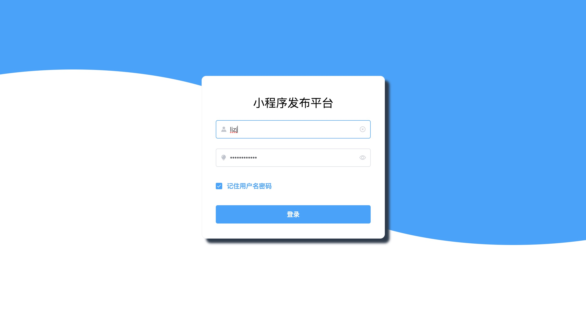
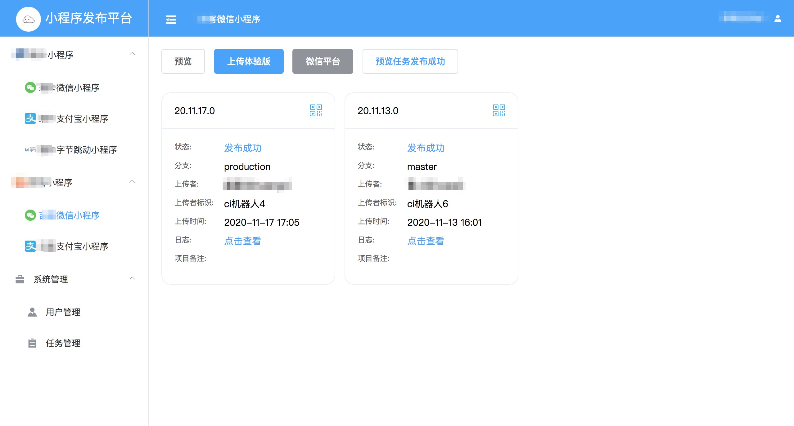
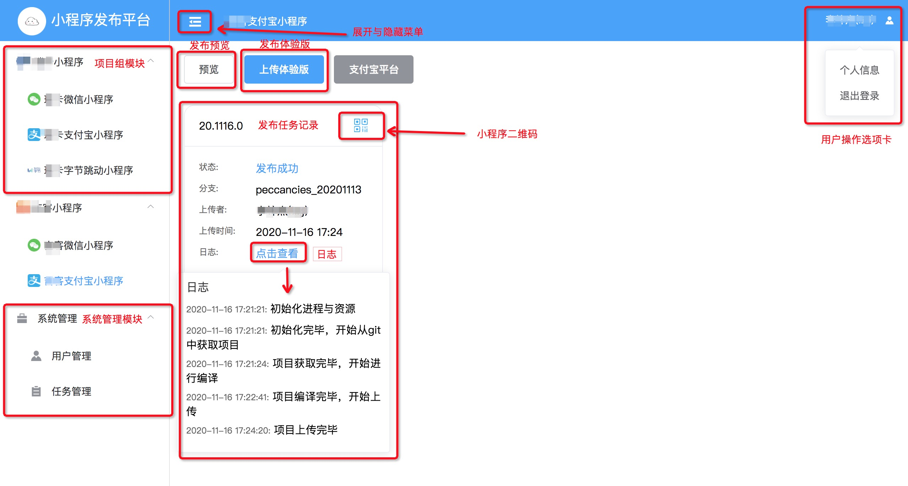
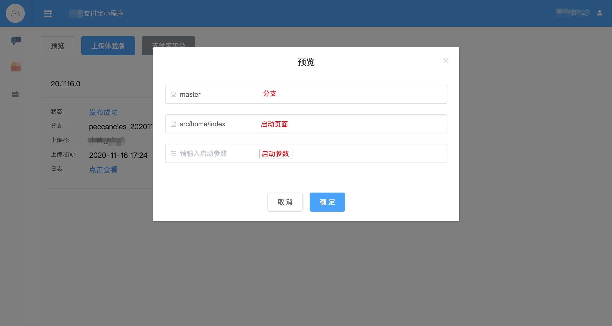

# 小程序发布平台

> 有问题欢迎在issues中提出

## 1 背景

  😈 如果你同时维护着多个小程序项目，那你每天是否花费了大量的时间在做这样一件时间，切换git分支 -> 执行编译 -> 打开小程序开发者工具 -> 发布。 <br>
  🧐 同时维护着5个小程序(两个微信小程序、两个支付宝小程序、一个字节跳动小程序)，我发现我每天要花大量的时间做发布小程序的工作。为此我想到了打造一个类似Jenkins的小程序自动化构建平台，将发布小程序的任务移交给测试同事(是的，我就是这么懒)。 <br>

## 2 项目界面介绍

tips: 图片无法加载的话，可以下载项目后看read-image文件夹

* [在线地址](http://39.108.210.55/)
* 账号: mp
* 密码: 123456

### 2.1 登录页



### 2.2 主页



### 2.3 主页带备注



### 2.4 发布预览



### 2.5 发布体验版


### 3 功能介绍

- 目前支持发布微信小程序、支付宝小程序、字节跳动小程序
- 角色划分为超级管理员、管理员、开发/运营/测试、普通用户
  - 超级管理员与管理员具备所有功能，其中超级管理员账号不可被删除
    - 具备用户管理功能，包括用户的增、删、查、改
    - 具备发布任务管理功能，包括任务的删、查功能
    - 具备发布预览、发布体验版功能
    - 具备修改用户个人信息功能
  - 开发/运营/测试
    - 具备发布预览、发布体验版功能
    - 具备修改用户个人信息功能
  - 普通用户
    - 只具备查看发布记录与小程序二维码功能

## 4 技术概览

该项目后端采用nestjs + typescript技术，ORM使用sequelize，数据库采用mysql。前端采用vue2全家桶，搭配SSR技术，通过socket广播发布日志到所有前端用户中。 <br>

技术详解请看(二次开发必看): [开发须知](./开发须知.md)

[原理教程请看](https://juejin.cn/post/6896823039099731975)

## 5 启动项目

### 5.1 本地开发时需要修改项目配置文件(部署到服务器中，不需要修改)

在/lib/configure文件中将redisCFG与mysql字段中的配置改为自己的配置，主要修改host字段即可

```js
{
  // redis用户记录session数据，不使用的话可以在/server/server.ts文件中找到session中间件，并注释掉store字段，即可删除所有与redisCFG配置相关的内容
  // 配置含义见connect-redis库
  redisCFG: {
    prefix: 'mp_release_platform_sess:',
    host: '0.0.0.0',
    port: 6379,
    db: 8,
  },
  // 配置含义见sequelize库
  mysql: {
    port: 3306,
    host: '0.0.0.0',
    user: 'mp',
    password: 'mp2020',
    database: 'mp_release_platform',
    connectionLimit: 10,
  },
}
```

### 5.2 修改小程序配置文件

找到/server/utils/CI/utils/ci-configure.ts文件，按照注释修改配置即可

### 5.3 安装依赖并运行

```shell
# cd至项目根路径
# 安装所需包
npm i

# 新建终端(command + t)，并运行redis
redis-server

# 运行项目
npm run start:dev

# 浏览器中访问 http://localhost:8088 or https://localhost:8089
```

## 6 项目部署说明

部署项目需要先安装docker，安装完成后再继续下面的步骤

```shell
# 自行安装git并设置好github的SSH
# 克隆小程序自动化构建平台项目
git clone git@github.com:lizijie123/mp_release_platform.git
# 进入项目目录
cd mp_release_platform
# 将小程序自动化构建平台打包为docker镜像
make
# 通过docker服务编排同时生成并启动，小程序自动化构建平台容器、redis容器、mysql容器
docker-compose up
```

## 7 常见问题

### 7.1 数据库数据是乱码

创建mysql的容器之前，需要设置字符集为utf8

```yaml
# 完整配置
mysql:
    restart: always
    image: mysql:5.6
    volumes:
        - ./data:/var/lib/mysql
    command: [
      '--character-set-server=utf8',
      '--collation-server=utf8_general_ci',
      --default-authentication-plugin=mysql_native_password,
    ]
    environment:
        - MYSQL_ROOT_PASSWORD=root
        - MYSQL_DATABASE=mp_release_platform
        - MYSQL_USER=mp
        - MYSQL_PASSWORD=mp2020
    ports:
        - "3306:3306"
```

对于已经创建了mysql容器的项目，只需要进入mysql中，删掉数据库并重新创建一个即可

```shell
# 单独启动mysql
docker-compose up -d mysql
# 查看mysql容器的id
docker ps
# 进入mysql容器
docker exec -it mysql容器id bash
# 连接mysql
mysql -ump -pmp2020
# 删除数据库
DROP DATABASE mp_release_platform
# 创建数据库并执行字符集
CREATE DATABASE mp_release_platform DEFAULT CHARSET utf8 COLLATE utf8_general_ci
```

### 7.2 拉取gitlab项目超时

公司gitlab一般只允许内网访问，部署在云服务器上的项目会出现无法访问gitlab项目的问题，需要运维同事帮忙在gitlab项目中设置访问白名单。

### 7.2 package.json中的devDependencies的包没有安装

当环境变量NODE_ENV为production时(也就是我们的小程序自动化构建平台这个项目运行时，设置的NODE_ENV)，npm install或yarn install只会安装dependencies，而不会安装devDependencies列表中的包，需要将安装命令改为npm install --dev或yarn install --production=false

### 7.3 编译项目过程中出现内存溢出问题

* 报错日志: FATAL ERROR: CALL_AND_RETRY_LAST Allocation failed - process out of memory

首先排查k8s分配给docker容器的内存大小是否足够，若k8s分配给docker容器的内存足够大，依然报内存溢出，则可能是系统分配给node的内存不足(tips: 分配给node程序的内存64位系统下约为1.4GB，32位系统下约为0.7GB)，这时候可以通过[increase-memory-limit](https://www.npmjs.com/package/increase-memory-limit)这个包解决。

## 8 作者

github： [lizijie123](https://github.com/lizijie123)
